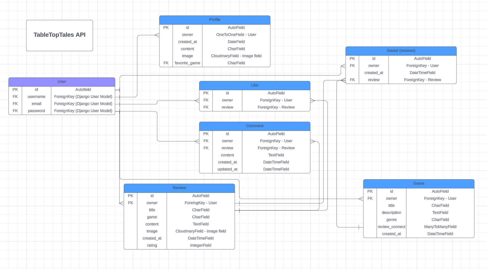

# ** TableTopTales API **

TabletopTales is a social media site for board games enthusiasts, targeted towards people who love to play board games and want to share their reviews for others! As well as finding new games to add to their wishlist of games they want to play. 

On TableTopTales users can write their own review of a game, create games to add to their whishlist, connect those games to an existing review, like and comment on other reviews. 

The app is built in two parts with this making up the backend API and the front end is built with React.js, link to front end page here [ ]. 

[Link to deployed backend API here](https://ttt-api-0a140d9077e3.herokuapp.com/)

## Project Goals
The goal of this site is to create a place where people can share reviews and discuss board games, and inspire other people to find their new favorite games! 

## UX

### User Stories

- As an admin I can create a ERD diagram so that I can easily work with the database and see how data is connected
- As an admin I can add authentication and authorization so that only the owner of a profile or review can edit it
- As an admin I can create the Profile app so that users can create an account and so that user data connected to their profile can be displayed, managed and saved
- As an admin I can create the Review app so that users can create reviews of games, so that users can save reviews and so that review data can be saved, displayed and managed
- As an admin I can create the Game app so that users can add reviews to games, and so that game data can be saved, displayed and managed
- As an admin I can create the Save app so that users can save reviews reviews that the like and view later, and so that save data can be managed, saved and displayed
- As an admin I can create the like app so that users can like reviews, and so that like data can be saved, displayed through the front end and managed
- As an admin I can create the comment app so that users can comment on reviews, so that comment data can be saved, managed and displayed
- As an admin I can deploy my app so that it can be used by everyone

## Agile Development
The application was built using an agile approach, using a Github Project Board and Issues. The Github project board can be found [here](https://github.com/users/MorganStenberg/projects/5/views/1). All user stories listed above were created with Github Issues. The user stories were used to keep track of progress throughout the project, via different columns specifying the status of the issue. With columns for 'Todo', 'In progress', 'Done' and 'DoD'. DoD, or Definition of Done was used for user stories that had been implemented and gone through testing. I also added a column for 'Backlog' for future features to be implemented, as a way to keep control of the scope of the project and be sure to deliver a MVP in time.

## Data Models and database

The ERD diagram below lays out the structure for the data models. 



## Features
The TableTopTales API contains six different apps, with each app endpoint being reached through adding the corresponding URL to the deployed API. 
The apps are, profiles, likes, comments, games, reviews, saved. 
Managing of the backend can be done by the superuser, by logging in via Django admin interface. 

## Testing

### Manual Testing

### Validator Testing
All the code has been run through Code Institue [CI Python Linter](https://pep8ci.herokuapp.com/). All code passed, except for some minor issues with whitespace and long lines. 

## Deployment
The back-end API app was deployed to Heroku from GitHub with the following steps:

- Create an external database using [ElephantSQL](https://www.elephantsql.com/). When logged in to your ElephantSQL account, click on “Create New Instance”, choose a plan and give it a name. Then select a region, click the "Review" button to view the details for your plan and finally click "Create instance". 

- Create a Heroku app by logging in to your Heroku account. Click the "New" button in the top right corner and then "Create new app". Give it a name, choose a region and then click the "Create app" button. 

- Attach the external database. 
	- In the Heroku app that you created, you need to create environment variables, called Config Var at Heroku. 
	- Go back to your ElephantSQL account, and from the dashboard click on the database instance name for the project. When in the project instance, copy the ElephantSQL database url by clicking on the copy icon. In the Config Vars section in at Heroku, add this url to the VALUE field and add DATABASE_URL to the KEY field. 
	- In your workspace, create a file called env.py in the top level directory. Add env.py to the list of files in your gitignore file. In the env.py file, import the os library and add the ElephantSQL DATABASE_URL. Below that, also add `os.environ['DEV'] = '1'`. You also need to choose and add a SECRET_KEY value like this: `os.environ.setdefault('SECRET_KEY', 'your-secret-key')`. The key also needs to be added as a config var at Heroku. Add SECRET_KEY in the KEY field and the secret key in the VALUE field. 

- Set up Cloudinary by installing it and the Pillow library. When logged in to your account on Cloudinary, copy your url on the Cloudinary dashboard and paste it into the env.py file, as with the SECRET_KEY and DATABASE_URL. Then go to Heroku and add the url to the config vars. Add CLOUDINARY_URL in the KEY field and your url in the VALUE field. Then also add static files settings in settings.py to tell Django to use Cloudinary.

- Connect to external database, create superuser for the database and make the migrations. Confirm connection to database by going to ElephantSQL and the page for your database.

- Install gunicorn, which is needed for the project to run on Heroku. Then you need to create a requirements.txt file: pip3 freeze --local > requirements.txt

- Create a Procfile and add the code: 
    release: python manage.py makemigrations && python manage.py migrate
    web: gunicorn table_tt_api.wsgi

- Add Corsheader to installed apps in settings.py, add Heroku to allowed hosts. Also set allowed_origins for networks requests and enable sending cookies in cross-origin requests under middleware in settings.py. 

- Change debug value from True to 'DEV' in os.environ, which means that DEBUG will be True if the DEV environment variable exists but False if it is not, meaning in production.

- Add JWT tokens functionality. Install the djangorestframework-simplejwt package, Add JWT_AUTH attributes. This will allow front end app and the API deployed to different platforms and the cookies will not be blocked.

- Set the JSON Renderer by adding: 'if 'DEV' not in os.environ: REST_FRAMEWORK['DEFAULT_RENDERER_CLASSES'] = ['rest_framework.renderers.JSONRenderer',]'

- Update requirements.txt file and deploy on Herukou through connecting to the repository on Github. 

- Fix dj-rest-auth bug according to instructions in walkthrough. The bug won´t allow users to log out. The issue is connected to the samesite attribute. 

To fix it create a views.py file in the app folder and import JWT_AUTH. Then, write a new logout view that sets both jwt tokens to empty strings and also pass samesite=JWT_AUTH_SAMESITE. Include the logout view in urls.py by importing it and add it to the urlpatterns list above the default dj-rest-auth urls. Then push the code to GitHub, and if you have chosen to manually deploy your app at Heroku make sure you deploy it again. In order to use the API with the front end app, add two new environment variables. Go to your allowed hosts in settings.py and copy the string/link for your Heroku app. Go to your app at Heroku, and then the settings tab. Add a config var with the key value of ALLOWED_HOST and paste in the string you copied from settings.py. Go back to settings.py and replace the heroku link with os.environ.get('ALLOWED_HOST'). In your settings.py file add: import re. Then, in the `if 'CLIENT_ORIGIN' in os.environ:...` code, replace the else statement and body with the following code:

```
if 'CLIENT_ORIGIN_DEV' in os.environ:
    extracted_url = re.match(r'^.+-', os.environ.get('CLIENT_ORIGIN_DEV', ''), re.IGNORECASE).group(0)
    CORS_ALLOWED_ORIGIN_REGEXES = [
        rf"{extracted_url}(eu|us)\d+\w\.gitpod\.io$",
    ]
```
Go to your deployed front end app and copy the url for the app. Then go back to Heroku and add a config var with the key CLIENT_ORIGIN and paste in the url you just copied as value. Then you need to go to your development environment for your front end app and copy the url for the development version of that app. At Heroku, add one more config var with the key CLIENT_ORIGIN_DEV and paste in the copied url for the development version. Then push the code to GitHub, and if you have chosen to manually deploy your app at Heroku make sure you deploy it again. 


## Technologies, frameworks, libraries and languages used

### **Languages**
- Python 

### **Frameworks**
- [Django Rest Framwork](https://www.django-rest-framework.org/) - Python web framework used to develop this API
- [Django](https://www.djangoproject.com/)

### **Software and Sites**
- [Git and GitHub](https://github.com/)- Version control and used as tool for agile development with Github Projects
- [Cloudinary](https://cloudinary.com/) - Image hosting and management
- [ElephantSQL](https://www.elephantsql.com/) - Free database service that hosts the PostgreSQL database for this project 
- [Lucidchart](https://www.lucidchart.com/pages/sv) - Used for creating ERD diagram

### **Other dependencies**
- [django-rest-auth](https://pypi.org/project/django-rest-auth/) - Provides a set of REST API endpoints for Authentication and Registration
- [django-allauth](https://django-allauth.readthedocs.io/en/latest/) - Set of Django applications addressing authentication, registration, account management as well as 3rd party (social) account authentication
- [Psycopg2](https://pypi.org/project/psycopg2/) - Python-PostgreSQL database adapter
- [dj_database_url](https://pypi.org/project/dj-database-url/) - method returning a Django database connection dictionary
- [Pillow](https://pypi.org/project/Pillow/8.2.0/) - Python Imaging Library 
- [urllib3](https://pypi.org/project/urllib3/1.26.15/) - User-friendly HTTP client for Python used by many components in Python, such as requests and pip
- [PyJWT](https://pypi.org/project/PyJWT/) - JSON Web Token implementation in Python
- [Gunicorn](https://gunicorn.org/) - Python WSGI HTTP Server acting as the web server for the project

## Credits

## Acknowledgements